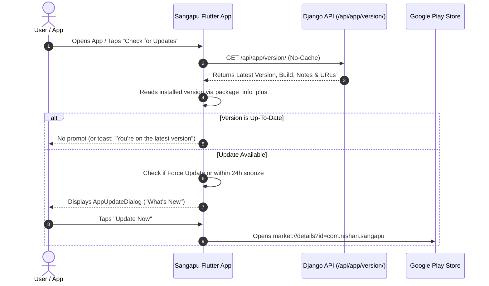

# Sangapu In-App Update System Documentation

This document explains the architecture, configuration, and operation of the **In-App Update System** implemented in Sangapu (`com.nishan.sangapu`).

---

## 1. Overview & Workflow

The Sangapu In-App Update System is a **Hybrid API-Driven Updater**:
1. When the mobile app opens (or when the user manually checks), it queries the backend API (`GET /api/app/version/`).
2. The app uses `package_info_plus` to retrieve the installed version (`2.1.10`) and build code (`28`).
3. It performs semantic version and build code comparisons.
4. If an update is detected, it renders a modern, non-intrusive **App Update Dialog** detailing What's New and linking directly to the Google Play Store (with fallback to direct APK download).



---

## 2. Backend API Endpoint

- **Endpoint:** `GET /api/app/version/`
- **Authentication:** Public (`AllowAny`) — accessible by all app builds.
- **Cache Policy:** Fresh data (no server-side stale caching).

### JSON Response Schema
```json
{
  "latest_version": "2.2.0",
  "latest_build_number": 29,
  "min_supported_version": "2.0.0",
  "min_supported_build_number": 20,
  "force_update": false,
  "title": "New Update Available!",
  "release_notes": "• Enhanced Excel spreadsheet export compatibility\n• Performance optimizations and bug fixes",
  "play_store_url": "https://play.google.com/store/apps/details?id=com.nishan.sangapu",
  "direct_download_url": "https://sangapu.nishanpradhan.com.np/download/latest.apk"
}
```

### Response Field Reference

| Field | Type | Description |
| :--- | :---: | :--- |
| `latest_version` | `string` | The current latest public release version (e.g. `"2.2.0"`). |
| `latest_build_number` | `int` | The latest build number code from `pubspec.yaml` (e.g. `29`). |
| `min_supported_version` | `string` | Lowest version allowed to run. Older versions trigger a forced update. |
| `min_supported_build_number` | `int` | Lowest build number allowed to run. |
| `force_update` | `bool` | If `true`, the update modal cannot be dismissed or bypassed. |
| `title` | `string` | Header title displayed on the mobile modal. |
| `release_notes` | `string` | Changelog and release highlights shown to the user. |
| `play_store_url` | `string` | Official Google Play Store listing link. |
| `direct_download_url` | `string` | Optional fallback link for standalone APK downloads. |

---

## 3. Backend Configuration

Configuration is located in `d:\sangapu_hotel_backend\core\settings.py`. You can configure it either directly in `settings.py` or via environment variables (`.env`) on your server:

```python
APP_VERSION_CONFIG = {
    "latest_version": config("APP_LATEST_VERSION", default="2.1.10"),
    "latest_build_number": config("APP_LATEST_BUILD_NUMBER", default=28, cast=int),
    "min_supported_version": config("APP_MIN_SUPPORTED_VERSION", default="2.0.0"),
    "min_supported_build_number": config("APP_MIN_SUPPORTED_BUILD_NUMBER", default=20, cast=int),
    "force_update": config("APP_FORCE_UPDATE", default=False, cast=bool),
    "title": config("APP_UPDATE_TITLE", default="New Update Available!"),
    "release_notes": config(
        "APP_UPDATE_RELEASE_NOTES",
        default="• Enhanced Excel spreadsheet export compatibility\n• Performance optimizations and bug fixes"
    ),
    "play_store_url": config(
        "APP_PLAY_STORE_URL",
        default="https://play.google.com/store/apps/details?id=com.nishan.sangapu"
    ),
    "direct_download_url": config(
        "APP_DIRECT_DOWNLOAD_URL",
        default="https://sangapu.nishanpradhan.com.np/download/latest.apk"
    )
}
```

---

## 4. Mobile App Implementation

### Key Files in `lib/features/app_update/`

1. **Model** ([`app_version_info.dart`](file:///d:/sangapu/lib/features/app_update/models/app_version_info.dart)):
   Parses the JSON payload from the version endpoint.

2. **Repository** ([`app_update_repository.dart`](file:///d:/sangapu/lib/features/app_update/repository/app_update_repository.dart)):
   Calls `app/version/` with `CachePolicy.noCache` so version checks are always live and never served from local cache.

3. **Manager** ([`app_update_manager.dart`](file:///d:/sangapu/lib/features/app_update/services/app_update_manager.dart)):
   - **Semantic Versioning Comparison:** Compares major, minor, and patch levels (`v2.2.0` vs `v2.1.10`) as well as build codes (`29` vs `28`).
   - **Force Update Detection:** Automatically forces an update if `force_update == true`, or if the installed version is below `min_supported_version` / `min_supported_build_number`.
   - **Snooze Mechanism:** For optional updates, user dismissal is remembered in `SharedPreferences` for **24 hours**. This ensures users are not interrupted repeatedly every time they switch tabs or open the app.
   - **Manual Check Override:** When triggered manually from the Drawer, it ignores snooze and gives immediate feedback ("Sangapu is up to date!" or prompts the update).

4. **Dialog** ([`app_update_dialog.dart`](file:///d:/sangapu/lib/features/app_update/widgets/app_update_dialog.dart)):
   - Dynamic gradient rocket badge.
   - Clear version indicators: `v2.2.0 (New)` vs `Current: v2.1.10`.
   - Scrollable **What's New** release notes container.
   - **Update Now** button: Opens `market://details?id=com.nishan.sangapu` with web fallback.
   - **Remind Me Later** button (automatically hidden if forced).
   - `PopScope(canPop: !forceUpdate)` prevents Android back button dismissal during critical forced updates.

5. **Drawer Integration** ([`dashboard_drawer.dart`](file:///d:/sangapu/lib/features/dashboard/widgets/dashboard_drawer.dart)):
   - Added **Check for Updates** menu tile with dynamic installed version subtitle (`v2.1.10+28`).
   - Added version label at the footer of the navigation drawer.

---

## 5. Step-by-Step: How to Push an App Update to Users

Whenever you prepare a new release of Sangapu:

### Step 1: Bump the App Version in Flutter
In `d:\sangapu\pubspec.yaml`, increment the version and build number:
```yaml
# Example: updating to version 2.2.0, build number 29
version: 2.2.0+29
```

### Step 2: Build & Publish to Google Play Store
Build your production App Bundle:
```bash
flutter build appbundle --release
```
Upload the generated `.aab` file to **Google Play Console** and submit for review.

### Step 3: Update the Backend Version Config
Once the release is approved or in staged rollout on Google Play, update the server settings:

**Option A: Via `.env` on your production server:**
```env
APP_LATEST_VERSION=2.2.0
APP_LATEST_BUILD_NUMBER=29
APP_FORCE_UPDATE=False
APP_UPDATE_RELEASE_NOTES="• Added new features\n• Fixed Excel statement exports\n• Faster report generation"
```

**Option B: Directly in `core/settings.py`:**
Update `APP_VERSION_CONFIG` defaults and commit/push to `origin/main`.

### Step 4: Verification
- Open Sangapu on any device running version `2.1.10`.
- The update modal will display automatically (or upon tapping **Check for Updates** in the menu).
- Tapping **Update Now** will redirect the user to Google Play to install the latest version.
